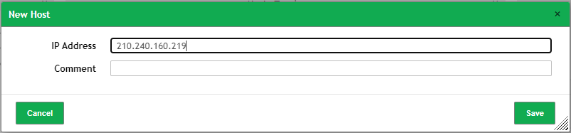

<!-- _backgroundImage: url('https://marp.app/assets/hero-background.jpg')-->
<!-- _class: lead -->

# Greenbone X 滲透測試平台

---

### 免責聲明

本文檔中的資訊僅供參考之用，不應被視為專業建議。在採取任何基於本文檔的行動之前，讀者應該進行獨立的評估和驗證。本文檔的作者或提供者不承擔因使用或依賴本文檔中的任何資訊而導致的任何直接、間接、偶發、特殊或後續損害的責任。

請注意，本文檔中提到的任何外部鏈接或參考資源都是在發布時認為可靠，但作者或提供者無法保證這些資源的持續可訪問性或準確性。對於任何外部鏈接的內容，作者或提供者不承擔責任。

本文檔的內容可能會隨時間而變更，作者或提供者保留隨時更新或更改資訊的權利，無需提前通知。

---

# 簡介

- 課程目標
    - Docker 的基本操作
    - Greenbone 的基本操作
    - 滲透測試的基本操作

---

# Docker 介紹與安裝

Docker 是一個開源的容器化平台，它允許開發者將應用程式及其依賴項打包到一個容器中。這個容器可以在任何支持Docker的系統上運行，確保了應用程式在不同環境間的一致性和可移植性。這對於開發、測試和生產環境的一致性提供了極大的便利。

---

## Docker 架構


---

## Docker Overview


---

## Docker 安裝

- Windows
    - [Docker Desktop](https://www.docker.com/products/docker-desktop)

- Mac
    - [Docker Desktop](https://www.docker.com/products/docker-desktop)

- Linux
    - ```bash
      sudo apt-get update
      curl -sSL https://get.docker.com | sh
      sudo apt install -y docker-compose
      ```

---

# Greenbone 介紹與安裝

Greenbone Security Manager (GSM) 是一款強大的漏洞管理解決方案，用於識別、管理和減輕網絡安全風險。它是基於開源漏洞管理工具OpenVAS的商業版本，提供全面的漏洞掃描、網絡監測以及報告功能。


---

#### 為什麼使用Greenbone?
- **全面的安全評估**：提供廣泛的漏洞掃描覆蓋，從網絡服務到應用程序層面的弱點。
- **持續監控**：能夠持續監控網絡狀態，即時發現新的或已知的漏洞。
- **易於管理的報告功能**：生成詳細的安全報告，幫助分析風險並規劃糾正措施。

---

## Greenbone 安裝

```bash
git clone https://github.com/hibana2077/hack2024_spring.git
cd hack2024_spring
cd greenbone
```

Windows

```bash
docker-compose up -d
```

Linux

```bash
sudo docker-compose up -d
```

---

## Greenbone 登入

如果你是安裝在本機，請使用以下網址開啟Greenbone。

- 網址：[http://localhost:9392](https://localhost:9392)

如果是遠端機器，你需要把 `localhost` 換成遠端機器的IP。

預設帳號密碼為：
admin / admin


---

## Greenbone 基礎介紹

- **Dashboard**：網絡狀態概覽
- **Scans**：漏洞掃描
- **Assets**：網絡設備
- **Administration**：管理設定

---

## Greenbone Dashboard

- Tasks by Severity Class
- Tasks by Status
- CVEs by Creation Time
- NVTs by Severity Class


---

## Greenbone Scans

- **Tasks**：掃描任務
- **Reports**：報告

---

## Greenbone Assets

- **Hosts**：主機
- **Operating Systems**：作業系統
- **TLS Certificates**：TLS 憑證

---

## Greenbone Administration

- **Users**：使用者
- **Feed Status**：資料庫狀態

---

## 漏洞資料庫簡短介紹

<!-- 在網絡安全領域，有三個主要的資料庫概念非常關鍵：NVTs、CVEs 和 CPEs。這些資料庫幫助組織識別、分類並應對潛在的安全威脅。 -->

### NVTs：Network Vulnerability Tests

NVTs 是一組用於檢測網絡設備和系統中已知漏洞的測試。這些測試通常由自動化的安全工具如OpenVAS進行，能夠檢查網絡中的各種設備是否容易受到已知攻擊的影響。NVTs 是維護網絡安全健康的重要工具，能夠提供即時的漏洞評估和管理。

---

## 漏洞資料庫簡短介紹

#### CVEs：Common Vulnerabilities and Exposures
CVEs 是一個廣泛認可的信息安全漏洞和曝光資料庫。每個CVE條目提供了一個標準化的識別號，用於公開分享全球範圍內的信息安全漏洞。這個系統使得安全專家可以在討論、管理和解決安全問題時共享資訊，並確保業界對特定漏洞有一致的理解。

---
## 漏洞資料庫簡短介紹

#### CPEs：Common Platform Enumeration
CPEs 是一套標準化方法，用於識別和枚舉應用程式、作業系統以及硬件設備中的漏洞。CPE提供了一個統一的命名架構，使得安全專家可以準確地描述系統中存在的特定產品和版本，從而在探討漏洞時提高溝通的清晰度和效率。

<!-- 這三種資料庫在網絡安全管理和漏洞評估過程中起著至關重要的作用，它們互相配合，提供了全面的工具和資訊，幫助組織防範和應對網絡威脅。 -->

---

## Vulnhub

[VulnHub](https://www.vulnhub.com/) 是一個提供實際安全漏洞練習機會的平台，專門為安全愛好者、教育者和IT安全專家設計。它提供了大量可自由下載的虛擬機映像，這些映像故意設計有安全漏洞，以便於進行滲透測試和安全訓練。


---

### 功能和用途

- **實戰訓練**：VulnHub 提供的虛擬機映像含有各種漏洞，用戶可以在一個安全的環境中練習滲透技術。
- **教育目的**：學校和培訓機構常用VulnHub來教學生實際的安全技巧，因為它可以模擬真實世界的安全挑戰。
- **技能提升**：對於有經驗的安全專業人員，VulnHub提供一個平台來鍛煉和提升解決複雜漏洞的能力。

---

## Vulhub

>Vulhub是一個基於docker和docker-compose的漏洞環境集合，進入對應目錄並執行一條語句即可啟動一個全新的漏洞環境，讓漏洞覆現變得更加簡單，讓安全研究者更加專注於漏洞原理本身。
-- VulnHub 官網

- [VulnHub](https://www.vulnhub.com/)


---

## Vulhub 下載

```bash
# Use wget to download the repository(bc. it's faster than git clone)
wget https://github.com/vulhub/vulhub/archive/master.zip -O vulhub-master.zip 
unzip vulhub-master.zip
```

```bash
# Entry vulnerability directory 
cd vulhub-master
```

---

## 實戰演練

這次以 `CVE-2020-17526` 為例，進行滲透測試。

---

## 漏洞描述

> Incorrect Session Validation in Apache Airflow Webserver versions prior to 1.10.14 with default config allows a malicious airflow user on site A where they log in normally, to access unauthorized Airflow Webserver on Site B through the session from Site A. This does not affect users who have changed the default value for `[webserver] secret_key` config. -- [CVE-2020-17526](https://cve.mitre.org/cgi-bin/cvename.cgi?name=CVE-2020-17526)

---

## 講人話

> 我忘記改配置文件了!

就是在Apache Airflow Webserver的某些版本中，如果保持默認配置，當一個惡意用戶在一個站點（Site A）正常登錄後，他可以利用同一個會話（session）信息在另一個站點（Site B）進行未授權的訪問。這是因為默認的[webserver] secret_key配置沒有被修改，導致跨站點的會話管理存在安全漏洞。

---

## 啟動漏洞環境

```bash
cd vulhub/airflow/CVE-2020-17526
```

Linux 環境要加上 `sudo`

```bash
docker compose run airflow-init
docker compose up -d
```

---

## 漏洞掃描

- 使用Greenbone掃描漏洞

**執行此實驗時，請確保你在台東大學校園網路中，否則可能被視為攻擊行為。**

---

## 建立 Asset

- 在Greenbone中建立一個新的Asset，用於掃描漏洞。
- IP：`210.240.160.219`



---

## 建立 Target


---

## 建立 Task


---

## 開始掃描


---

## 掃描結果 I


---

## 掃描結果 II


---

## 掃描結果 III


[CVE-2022-45188](https://nvd.nist.gov/vuln/detail/CVE-2022-45188)

---

## 生成報告


---

## 結論

- Docker 的基本概念與操作
- 漏洞資料庫的認識
- Greenbone 的基礎操作

---

## 參考資源

- [Docker Documentation](https://docs.docker.com/)
- [Greenbone Community Edition](https://greenbone.github.io/docs/latest/22.4/container/index.html)
- [VulnHub](https://github.com/vulhub/vulhub)
- [CVE-2020-17526](https://cve.mitre.org/cgi-bin/cvename.cgi?name=CVE-2020-17526)

---

<!-- _backgroundImage: url('https://marp.app/assets/hero-background.jpg')-->
<!-- _class: lead -->

## 結束